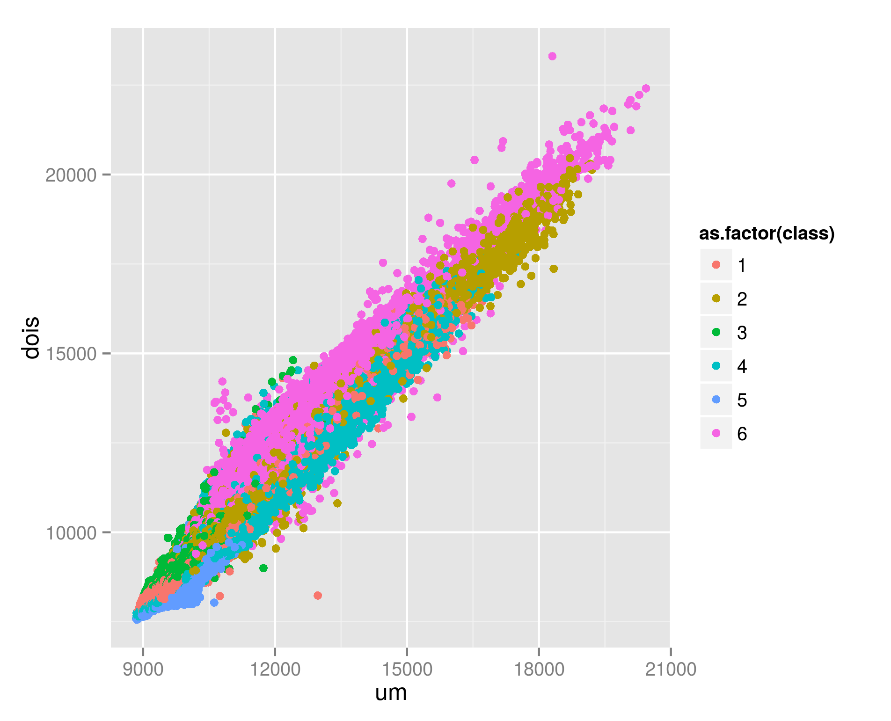

Proposta de análise da cobertura (principalmente florestal) do município do Rio de Janeiro em diferentes anos, através de ferramentas espaciais do **R**.  

Aqui apresentarei apenas a análise apra um ano: 2006.  

A proposta é fazermos uma classificação não supervisionada baseada em estatística espacial, para os anos pertinentes aos projeto *FAPERJ* **Mutirão de reflorestamento**. A partir da classificação não supervisionada, podemos atribuir a cada classe, a sua respectiva  cobertura/uso.  
Com isso:  
  
1. Ganharemos tempo  
1. Teremos todo o processo documentado por script e funções do **R**  
1. Teremos a possibilidade de ampliarmos a gama de análise dos dados  
    
```{r, echo=FALSE, warning=FALSE, message=FALSE, error=FALSE, results='hide'}  
library(raster)
library(rgdal)

# loading landsSat image
rj_2016 <- stack('./Landsat_imagery/rj_2016_pixel.tif')
# Loading county boundary
rj <- readOGR(dsn='./shape/', layer='33MUE250GC_SIR')
# unique(rj@data$NM_MUNICIP)
rj <- rj[rj@data$NM_MUNICIP=='RIO DE JANEIRO',]

#Changing Carthographc Reference System
rj <- spTransform(rj, CRS=CRS(proj4string(rj_2016)))

# Changing LandSat extent
rj_2016 <- crop(rj_2016, rj)

# Calculatin NDVI
ndvi <- overlay(rj_2016[[4]], rj_2016[[5]], fun=function(x,y){(x-y)/(x+y)})
rj_2016_2 <- addLayer(rj_2016,ndvi)
#plotRGB(rj_2016_2, r=7,g=3, b=2, stretch='hist')

library(RColorBrewer)
pallete <- brewer.pal(6, 'Accent')
```  

## Dados básicos da análise  
1. Imagem de satélite  
1. Área de estudo  
  
```{r}
# Plotting input data
plotRGB(rj_2016, r=4, g=3, b=2, stretch='hist')
plot(rj, add=TRUE)
```  
  
## Algorimos de classificação não supervisionada  

Na função que criamos, podemos usar dois algoritmos básicos: **Kmeans** e **randomForest**;
No exemplo dado, foi usado apenas o algoritmos **Kmeans**, que tem como vantagem o uso de todos os pixels da imagem na análise de grupamento.  
  
```{r running, eval = FALSE}
# Running cluster analysis (Automatic classification)
source('~/Projetos/SegmentationFCT/segmentation.R')
args(segmentation)
segmentation(envLayer = rj_2016_2, studyArea = rj, projName = "RJ_2016", 
          randomforest = FALSE, random.pt = NULL, Kmeans = TRUE, ngroup = 6, 
          polygonize = FALSE, seed = 123) 
```  

##Resultado  
  
```{r, warning=FALSE,message=FALSE,error=FALSE}
# Result
RJ_2016_seg <- raster('./km_segmentation_RJ_2016.tif')
plot(RJ_2016_seg, col=pallete)
```  
```{r, warning=FALSE,message=FALSE,error=FALSE}
# Result
par(mfrow=c(2,1))
plotRGB(rj_2016, 4, 3, 2, stretch='hist')
plot(RJ_2016_seg, col=pallete)
```  

Basta portanto, identificar a cada classe criada o respectivo uso e/ou cobertura da terra. O tempo de processamento não é grande. E, depois, podemos fazer uma mascara para vermos a evolução das áreas do mutirão, já que estamos analisando todo o município.  
Visualmente, podemos ver que:  
  
1. **classe 1**, com cor **verde**: poderia ser classificada como **áreas florestais**  
1. **classe 2**, com cor **roxa** (ou coisa parecida): seriam as **áreas urbanas**  
1. **classe 3**, com cor **laranja**: seriam áreas florestais, mas com alguma diferença da **classe 1**  
1. **classe 4**, em **amarelo**: pouco aparecem, seriam **áreas de areia**  
1. **classe 5**, em **azul**: seriam **corpos d'água**  
1. **classe 6**, em **vermelho**: **áreas urbanas**, mas com resposta diferente da **classe 2**  
  
## Análise dos resultados  

Um pequeno exemplo de pós processamento é vermos como cada classe identificada está se comportando em relação às bandas da imagem de satélite (resposta espectral).  
O exemplo dado é muito básico, mas é possível evoluimos bastante nisso.  

```{r, eval=FALSE}
# Analysing band relation with category
graph <- addLayer(rj_2016, RJ_2016_seg)
class.df <- (as.data.frame(graph))
head(class.df)
colnames(class.df)<-c('um','dois','tres','quatro','cinco','seis','class')

#Plot
library(ggplot2)
ggplot(class.df, aes(x=um, y=dois, colour=as.factor(class))) + geom_point()
ggsave('./class_analysis.png')
```  
  

## Perspectivas futuras  
  
Ainda não pude pesquisar, mas imagino que existam pacotes espacíficos do **R** para Sensoriamento Remoto, que poderão nos ajduar bastante nas análises.  
Acho que assim que terminar com as modelagens para Mata Atlantica, poderiamos ver isso.  